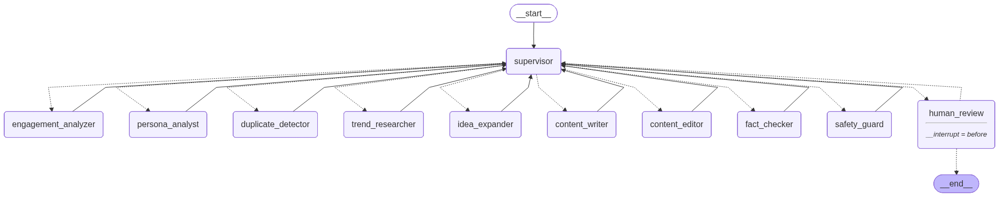

# AIPost — Generación agéntica de contenido para LinkedIn (TFG)

AIPost es una plataforma de generación de contenido para LinkedIn basada en un
**pipeline multi-agente** (LangGraph) que investiga, redacta, verifica y audita
cada publicación antes de entregarla al usuario. Su valor diferencial frente a
"un LLM con contexto" se demuestra empíricamente con el harness de
[`evaluation/`](evaluation/README.md).



## Arquitectura

- **Backend**: FastAPI + Celery (Redis) + Supabase (PostgreSQL + pgvector + Realtime).
- **Orquestación**: grafo LangGraph con **supervisor determinista** (ruteo por
  estado, sin LLM), checkpointing persistente en Postgres (Supavisor, puerto 6543)
  y pausa **Human-in-the-Loop** (`interrupt_before=human_review`).
- **Nodos**: engagement analyzer, persona analyst, duplicate detector,
  trend researcher, idea expander, content writer (con bucle de investigación
  autónoma RAG+web), content editor (ediciones HITL), **fact checker CRAG por
  claim**, safety guard y revisión humana.
- **Autocorrección**: si el fact checker o el safety guard rechazan el borrador,
  el control vuelve al writer con el reporte de errores (máx. 3 ciclos,
  presupuesto que se resetea con cada feedback humano).
- **Frontend**: Next.js (`postfast-frontend/`).

## Puesta en marcha

```bash
poetry install --with dev
cp .env.example .env   # y completa credenciales (ver variables abajo)

# Backend API
poetry run uvicorn src.main:app --reload

# Worker Celery
poetry run celery -A src.celery_app worker --loglevel=info

# Frontend
cd postfast-frontend && npm install && npm run dev
```

### Variables de entorno principales

| Variable | Uso |
|---|---|
| `GENAI_API_KEY` | Google Gemini (LLMs + embeddings) |
| `SUPABASE_URL`, `SUPABASE_KEY` | Clave privilegiada de backend (nunca se expone) |
| `SUPABASE_ANON_KEY` | Clave pública para el Realtime del frontend (`/config`) |
| `SUPABASE_CONN_STRING` | Checkpointer Postgres (Supavisor :6543) |
| `CELERY_BROKER_URL`, `REDIS_HOST`, `REDIS_PORT` | Cola de tareas |
| `TAVILY_API_KEY` | Búsqueda web (tendencias y verificación de claims externos) |
| `LANGCHAIN_API_KEY` | (Opcional) tracing LangSmith por nodo |
| `AIPOST_DEMO_MODE` | `true` habilita los tokens `mock_*` de demostración (solo local) |
| `AIPOST_CHECKPOINTER` | `memory` para tests/evaluación offline |
| `SMART_LLM`, `MEDIUM_LLM`, `FAST_LLM`, `JUDGE_LLM` | Jerarquía de modelos configurable |

Las migraciones de base de datos viven en [`migrations/`](migrations/).

## Tests y CI

```bash
poetry run pytest tests/ -v     # supervisor determinista, flujo del grafo, chunking, editor
poetry run ruff check src evaluation tests
```

GitHub Actions ejecuta lint + tests en cada push ([.github/workflows/ci.yml](.github/workflows/ci.yml)).

## Evaluación comparativa (defensa del TFG)

```bash
python -m evaluation.run_eval --org-urn "urn:li:organization:XXXX"
python -m evaluation.evaluate evaluation/results/run_<fecha>.jsonl
```

Metodología completa (baselines, juez ciego, métricas objetivas, ablación de
nodos y presupuesto de cuota) en [`evaluation/README.md`](evaluation/README.md).
